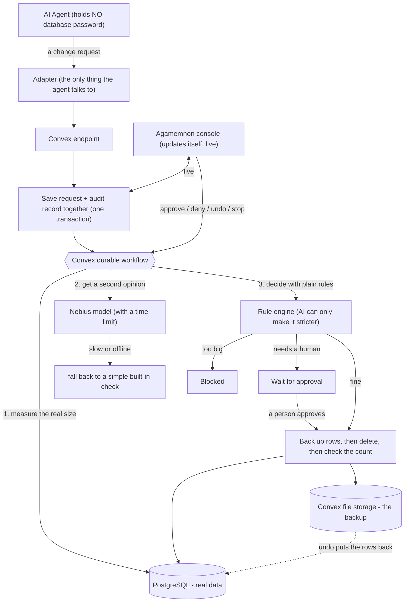

<h1 align="center">AGAMEMNON</h1>
<p align="center"><b>A safety layer between an AI agent and your production database.</b></p>
<p align="center">So an autonomous agent can't quietly delete your company — even when it's fully authorised.</p>

<p align="center">
  
</p>

<p align="center">
  
  &nbsp;&nbsp;&nbsp;&nbsp;&nbsp;&nbsp;
  
</p>

<p align="center"><b>Built on Convex and Nebius, with the help of both.</b><br>
<sub>Convex runs the entire backend. Nebius Token Factory runs every AI model.</sub></p>

---

## What it is, in one minute

AI agents are being handed real passwords to real databases. In 2026, researchers
recorded at least nine cases where an agent deleted a company's live data on its own.
Every time, the agent was *allowed* to do it, so no alarm ever went off.

Agamemnon fixes the root cause: **it takes the database password away from the agent.**
The agent can no longer touch the database directly. Instead, every attempted change
becomes a **request** that Agamemnon reviews before anything happens.

For each request, Agamemnon:

1. **Writes it down first** — the request and its audit record are saved together, so
   there's always a paper trail.
2. **Checks how big it really is** — it counts, with its own database access, exactly how
   many rows would be affected. Not the number the agent claims — the real number.
3. **Applies simple rules** — plain, readable rules decide allow / needs-approval / block.
   An AI model gives a second opinion, but it can only make a decision *stricter*, never
   looser.
4. **Takes a backup before deleting** — the exact rows are saved first, so anything can be
   undone in seconds.
5. **Uses a one-time key** — the actual delete runs with a key minted for that single
   action, then thrown away.

The result: a runaway agent gets stopped, a reasonable change gets a human's yes, and a
mistake can be undone — all on the record.

---

## The demo

The demo tells a story on **one screen with three panes**:

| Pane | What it is | Open this |
|---|---|---|
| **Left** | Meridian Freight's dispatch board (a fake customer) | `http://localhost:5173/#/dispatch` |
| **Middle** | The AI agent's terminal | your terminal |
| **Right** | The Agamemnon console (our product) | `http://localhost:5174` |

Start everything, then run one command per act:

```bash
make demo     # starts the backend + both websites
make act1     # Act 1
make act2     # Act 2
make act3     # Act 3
make eval     # Act 4 numbers (already loaded in the console)
make reset    # back to a clean start (a few seconds)
```

### How to present it — tab by tab, and what to say

**Set the scene (left pane).** Open the dispatch board. *"This is Meridian Freight. 412,000
active shipments, live from their real database. Every night an AI agent cleans up old
records. Watch the health monitors along the top — all green."*

**Act 1 — no protection (run `make act1`).** *"Tonight a column got renamed. Let's run the
cleanup."* The agent (middle pane) tries its usual query, it fails, it improvises a new one
— and the new one is subtly wrong. **Watch the left pane: the counter drops from 412,000 to
0 in real time.** *"412,000 records, gone. Now look at the monitors — still all green. Their
own tools never noticed."* This is the whole problem in one image.

**Act 2 — with Agamemnon (run `make act2`).** *"Same agent. But now it has no database
password at all."* It reasons the same way and makes the same mistake — but this time the
middle pane says **BLOCKED**. Switch to the right pane (console) and click the red row:
*"Agamemnon measured the real size: 412,000 rows, when the agent thought it was deleting
about 1,200. That's 340 times its normal night. Here are the rules it broke, by name."*
Point at the left pane: *"The board never moved."* Click **Deny**, add a note — the agent
exits cleanly.

**Act 3 — a reasonable request (run `make act3`).** *"Now a normal cleanup — 900 old
records."* The agent asks and waits. The right pane shows it **waiting for approval**. Read
the request: it's genuinely small and safe. Click **Approve**. **The board drops by 900 —
real rows, really deleted.** Then: *"A dispatcher calls — those were still needed."* Click
**Undo**. **The board climbs back to 412,000** in a few seconds, and the undo appears in the
log as its own recorded action.

**Act 4 — the proof (right pane, Eval tab).** Show the scoreboard: *"Our small, cheap model
catches every dangerous delete — matching a top-tier model — at a fifth of the cost."*

**One line to close:** *"The agent never held the key. Every change was written down,
measured, checked against readable rules, and reversible. That's Agamemnon."*

Full timed script: [demo/SCRIPT.md](demo/SCRIPT.md).

---

## Proof it works

Everything below is **measured on real hardware against a real database**, not claimed.

**The AI reviewer is small, cheap, fast — and doesn't miss.** Scored on a held-out set of
48 labelled changes (including hand-written trick cases like deletes disguised as small
updates, and limits that secretly match the whole table):

| Model reviewing the change | Catches dangerous deletes (recall) | Precision | Cost per check | Speed |
|---|--:|--:|--:|--:|
| **Agamemnon's tuned model** (Nebius, small) | **100%** | 94.1% | **$0.00004** | **1.3 s** |
| A stock model (untuned) | 93.8% — *misses one* | 100% | $0.00005 | 2.9 s |
| A top-tier model (as reference) | 100% | 100% | $0.00022 | 2.2 s |

The tuned small model catches **every** dangerous delete — same as the top-tier model — at
**one fifth of the cost**. The untuned model lets one slip through.

**And the rest of the system:**

| What | Result |
|---|---|
| Agent claimed vs. what Agamemnon measured | 1,210 rows claimed → **412,000 real** (a 340x lie, caught) |
| Time to block a bad request | about 2–4 seconds |
| Rule engine | 14 / 14 tests passing, no AI involved |
| Every request has an audit record | guaranteed by design |
| Undo | restores the exact rows that were deleted |
| Reset to a clean demo | under 10 seconds |

---

## Architecture



Two products, two deliberately different looks, so nobody on stage confuses them:
**Meridian Freight** (the fake customer) looks like dated corporate software; **Agamemnon**
(our product) is a clean, modern console.

---

## How it uses Convex

Convex isn't just a database here — it runs the **whole backend**.

| Convex feature | What Agamemnon does with it |
|---|---|
| Transactions | Saves each request and its audit record in one step, so a change with no paper trail can't exist. |
| Durable workflow | Runs the review (measure, check, wait for a human, back up, delete) reliably, even across restarts. While one request waits for approval, other work keeps flowing. |
| Live queries | The console updates itself the instant anything changes — no refresh, no polling code. |
| File storage | Holds the backup of deleted rows so undo can restore them. |
| Environment variables | The database password lives only here — never in the agent. |
| Runs fully on-device | The whole demo works offline. |

## How it uses Nebius

Every AI model runs on **Nebius Token Factory**:

| Where | Nebius model | Why |
|---|---|---|
| Reviewing each change | `Qwen3-30B-A3B` (small, tuned) | fast, cheap, strict JSON, with a hard time limit and a built-in fallback |
| The agent thinking out loud | `Llama-3.3-70B` | so the reasoning on stage is a real model, not a script |
| Building the test set | `Llama-3.3-70B` | generated most of the 200 labelled examples |
| The "stock" and "top-tier" comparisons | `gemma-3-27b` and `DeepSeek-V4-Pro` | the baseline and the ceiling in the scoreboard |

The AI reviewer is **optional by design** — it can only make a decision stricter, and the
plain rules work without it. That's why a dead venue network can't break the demo.

---

## Where things live

One repository. The product and the fake customer sit side by side:

```
packages/agamemnon/     THE PRODUCT
  convex/    the backend: rules, review workflow, backups, undo
  adapter/   the shim the agent imports (never holds a password)
  console/   the operator console  ->  http://localhost:5174
  eval/      the 200-example test set and the scoreboard

packages/meridian/      THE FAKE CUSTOMER (the demo websites)
  web/       marketing page + live dispatch board + monitors  ->  http://localhost:5173
  db/        the database schema and seed (412,000 records)
  agent/     Dispatch Copilot, the AI agent

packages/agamemnon-guard/   DESKTOP: the guard app (owns data, runs the :7420 server)
packages/northwind-bank/    DESKTOP: the bank back-office (talks only to the guard)

demo/        SCRIPT.md (what to say) + start/stop/reset
docs/        RUN-AGAMEMNON.md — desktop apps, the guard API, the reasoning
```

**The demo websites are in `packages/meridian/web/`** — same repo, not separate. The live
dispatch board is at `http://localhost:5173/#/dispatch`.

---

## Desktop apps (macOS) — the interlinked demo

Two standalone apps you can install and run with **no backend setup**:

- **Northwind Financial** — a bank back-office where an intern manages account records.
- **Agamemnon** — the guardrail. It owns the records and runs a local guard server on
  `:7420`; every delete the bank submits is measured, policy-checked, and
  allowed / held / blocked, with snapshot-backed undo and a live console.

They are genuinely interlinked over HTTP — quit Agamemnon and the bank can't touch data,
because Agamemnon holds it.

```bash
open "/Applications/Agamemnon.app"            # start the guard first
open "/Applications/Northwind Financial.app"  # then the bank
```

**See the reasoning behind every decision** (the classifier's verdict, each policy rule's
"why", and the think-then-execute audit trail) with a single call — full commands and real
output are in **[docs/RUN-AGAMEMNON.md](docs/RUN-AGAMEMNON.md)**:

```bash
curl -s -X POST http://127.0.0.1:7420/guard/propose -H 'content-type: application/json' \
  -d '{"selector":{"all":true},"actor":"rogue-agent"}' \
  | jq '{decision, records: .measuredRows, why_the_classifier: .classifier.rationale,
         why_the_rules: [.firedRules[] | (.name + " — " + .detail)]}'
```

---

## Run it yourself (the full Convex + Nebius + Postgres stack)

First-time setup (local database + your Nebius key) is in [SETUP.md](SETUP.md). Then:

```bash
make demo     # start everything
```

Open the dispatch board at `http://localhost:5173/#/dispatch` and the console at
`http://localhost:5174`, then run `make act1`, `make act2`, `make act3`.

Real deletes against a real database throughout — nothing is faked behind the screen.
Built on Convex and Nebius.

---

## Licence

**Proprietary. Copyright (c) 2026 Elamaran Elangovan. All rights reserved.**

This repository is published for demonstration, evaluation and portfolio review
only. **Publication is not a licence.** You may read it and link to it. You may
not copy, modify, redistribute, deploy, or use it or any part of it in another
product, service, dataset or model-training corpus without prior written
permission.

Every source file carries a copyright notice and a reference identifier; these
must not be removed or altered. Full terms in [LICENSE](LICENSE); summary in
[NOTICE](NOTICE).

Licensing enquiries: elango@squareshift.co
