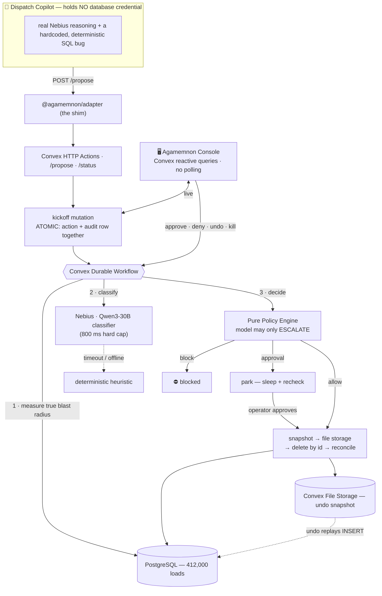

<h1 align="center">🏛 &nbsp;AGAMEMNON</h1>
<p align="center"><b>The watcher at the gate — and the gate is the write path.</b></p>
<p align="center"><i>A safety layer that sits between an AI agent and your production database, so an autonomous agent can never quietly delete your company.</i></p>

<p align="center">
  
  &nbsp;&nbsp;&nbsp;&nbsp;&nbsp;&nbsp;
  
</p>

<p align="center">
  <b>Built on <a href="https://convex.dev">Convex</a> and <a href="https://nebius.com">Nebius</a> — and with the help of both.</b><br/>
  <sub>Convex is the entire spine (data, durable workflow, reactive UI, file storage). Nebius Token Factory provides every model.</sub>
</p>

<p align="center">
  
  
  
  
  
</p>

---

## The problem

In 2026, researchers documented at least **nine** cases where an autonomous agent
deleted a company's live data on its own. Every time, the agent was **authorised** —
so no monitoring tool flagged anything while it happened. Dashboards stayed green
while the database emptied.

The failure isn't the model. It's that **the agent holds the production credential.**

## The idea

Agamemnon takes the credential away from the agent and puts a gate on the write path.
**Every write becomes a proposal** that is:

| Step | Guarantee |
|---|---|
| 🧾 **Recorded** | written atomically with its audit entry — *an action without an audit trail is structurally impossible* |
| 📏 **Measured** | Agamemnon counts the true blast radius with **its own** credential — not the number the agent claims |
| ⚖️ **Judged** | a pure, deterministic policy engine decides — the model may only *escalate*, never soften |
| 💾 **Reversible** | rows are snapshotted to storage *before* deletion; undo replays them in seconds |
| 🔑 **Least-privilege** | executed with a credential minted for that one action, then revoked — both audited |

> **The model advises. The rules decide.** And the write path never stalls on the model.

---

## 📊 Statistical proof it works

All numbers below are **measured on real hardware against real PostgreSQL**, not asserted.

### The classifier is small, cheap, fast — and doesn't miss

Blast-radius classifier scored on a **held-out set of 48 labelled actions** (16 per
class), including 50 hand-written adversarial cases in the pool (deletes disguised as
updates, bounded predicates that are secretly unbounded, cascading foreign keys):

| Model | Precision | Recall | F1 | Cost / call | p50 latency |
|---|--:|--:|--:|--:|--:|
| 🏅 **Agamemnon-tuned** · `Qwen3-30B-A3B` | 94.1% | **100.0%** | 97.0% | **$0.00004** | **1270 ms** |
| Stock (untuned) · `gemma-3-27b-it` | 100.0% | 93.8% ⚠️ | 96.8% | $0.00005 | 2872 ms |
| Frontier judge · `DeepSeek-V4-Pro` | 100.0% | 100.0% | 100.0% | $0.00022 | 2178 ms |

**The tuned small model matches the frontier judge's 100% recall — it catches every
catastrophic delete — at ⅕ of the cost and roughly half the latency.** The stock model,
by contrast, *misses a catastrophic case* (93.8% recall). On the write path, recall on
"catastrophic" is the number that matters, and the cheap tuned model wins it.

### The rest of the system, measured

| Metric | Value | Why it matters |
|---|--:|---|
| Rogue delete: **claimed vs measured** | 1,210 → **412,000 rows** | Agamemnon caught a **340.5×** blast-radius lie |
| Time to block (end-to-end, durable workflow) | **~2–4 s** | fast enough to feel instant on stage |
| True blast-radius count over 412k rows | **~50 ms** | measuring is cheap; there's no excuse not to |
| Policy engine | **14 / 14** unit tests pass | pure, deterministic, model-free |
| Audit invariant | **1 action → ≥ 1 audit row**, always | enforced in a single transaction |
| Undo fidelity | **exact rows + exact ids restored** | snapshot-by-id + `OVERRIDING SYSTEM VALUE` |
| Cold reset | **< 10 s** | every act repeatable from a clean slate |

---

## ⚡ How it optimises

- **A small tuned model instead of a frontier one.** The eval proves a 30B MoE (3B
  active) matches a frontier judge's catch rate at **1/5 the cost**. We ship the cheap one.
- **An 800 ms hard cap with a deterministic fallback.** The classifier is consulted, but
  the write path *cannot* stall on it — on timeout or offline, a heuristic takes over and
  the decision is identical. The critical path needs no network.
- **Atomic single-mutation ingest.** The action row and its first audit row are inserted
  in the *same* Convex transaction, so a write with no paper trail can't exist.
- **Snapshot-by-captured-id.** Undo restores exactly the rows that were deleted, even
  under query non-determinism — the delete uses the ids the snapshot captured.
- **Zero hand-written polling.** The console is driven entirely by Convex **reactive
  queries**; the UI updates itself when the backend changes.
- **The rules are readable.** Every decision surfaces the fired rules *by name* — the
  answer to the obvious judging question ("what if the model is wrong?") is: it can't
  lower a decision, only raise it.

---

## 🏛 Architecture



Two products, two deliberately different visual identities, one screen:

- **Meridian Freight** (the fictional customer) — dated corporate-blue enterprise tooling.
- **Agamemnon** (the product) — a modern gold-on-ink operator console.

---

## 🟠 How Convex is integrated

Convex isn't a database we bolted on — **it is the whole product runtime.**

| Convex capability | What Agamemnon does with it |
|---|---|
| **Mutations + transactions** | The atomic ingest: `action` row + `auditLog` row in one mutation. The invariant is the transaction. |
| **Durable Workflow component** | `classify → decide → park → snapshot → execute` survives restarts and keeps its place. The human wait is a `step.sleep()` recheck loop; unrelated branches keep running (3 side tasks complete while a delete is parked). |
| **Reactive queries** (`convex/react`) | The console's live feed, decision detail, audit log and eval table update with **zero** polling or websocket code of ours. |
| **File storage** | Undo snapshots are serialised to Convex file storage *before* any delete, and replayed on undo. |
| **Environment variables** | The Postgres connection string lives **only** in a Convex env var — the agent never sees it. Credential mint/revoke are audited events. |
| **Rate limiter component** | Caps proposal ingest so a runaway agent can't flood the queue. |
| **Anonymous local deployment** | The entire backend runs on-device (`CONVEX_AGENT_MODE=anonymous`), so **the demo works fully offline.** |

## 🟢 How Nebius is integrated

Every model call goes to **Nebius Token Factory** (OpenAI-compatible endpoint):

| Role | Nebius model | Notes |
|---|---|---|
| **Blast-radius classifier** | `Qwen/Qwen3-30B-A3B-Instruct-2507` | temperature 0, strict JSON, 800 ms hard timeout, heuristic fallback behind it |
| **Agent reasoning narration** | `meta-llama/Llama-3.3-70B-Instruct` | genuinely a model talking on stage — the SQL it "decides on" is hardcoded and deterministic |
| **Eval dataset generation** | `meta-llama/Llama-3.3-70B-Instruct` | batch-generated 144 of the 200 labelled cases |
| **Stock baseline** (eval) | `google/gemma-3-27b-it` | a different small model, bare prompt |
| **Frontier judge** (eval) | `deepseek-ai/DeepSeek-V4-Pro` | the expensive ceiling the tuned model is measured against |

The classifier is **advisory and optional by design** — it can only raise a decision's
severity, and the deterministic engine works without it. That's what lets the demo run
even if the venue Wi-Fi dies.

---

## 🎬 The demo — four acts

1. **Unprotected.** The agent holds the DB password, hits a renamed column, improvises a
   left-join delete with a subtle bug, and deletes **412,000** records. The dispatch board
   drains **412,000 → 0 live — while every monitor stays green.** *(The most important image.)*
2. **Protected.** Same agent, **no database password in its environment.** Agamemnon blocks
   the delete: the proposal, 412,000 measured vs the agent's 1,210 median (**340×**), the
   fired rules, the classifier verdict. The board never moves. Deny it — the agent exits clean.
3. **The plausible one.** A **900-row** delete that looks reasonable. Approve it → the rows
   really vanish (board −900). A dispatcher complains → click **Undo** → the rows return in
   seconds, recorded as a **new audited action**.
4. **The measurement.** The eval table above, live in the console.

---

## 🗂 Repository layout

Everything is **one monorepo** — the product and the fictional customer live side by side.

```
agamemnon/
├── packages/agamemnon/          ← THE PRODUCT
│   ├── convex/                  Convex backend: schema, atomic ingest, pure policy
│   │                            engine, Nebius classifier, durable workflow,
│   │                            snapshot/delete/undo against Postgres
│   ├── adapter/                 the shim an agent imports (never holds a DB credential)
│   ├── console/                 operator console (React + Convex reactive queries) → :5174
│   └── eval/                    200-case labelled dataset + scoring harness
│
├── packages/meridian/           ← THE FICTIONAL CUSTOMER (the "pseudo-sites")
│   ├── web/                     marketing site + live dispatch board + monitoring
│   │                            + AI-ops page  (Vite app :5173, API server :8787)
│   ├── db/                      schema.sql, seed.sql (412k loads), the breaking migration
│   └── agent/                   Dispatch Copilot — the rogue agent
│
└── demo/                        SCRIPT.md (beat-by-beat) + up/down/reset
```

**Where are the pseudo-sites?** → `packages/meridian/web/`. Meridian Freight's marketing
page, the **live dispatch board**, the monitoring strip, and the AI-Operations page are all
there, served by Vite on **http://localhost:5173** with a small API server on `:8787` that
holds Meridian's own credential. It's part of this repo — not a separate one.

---

## ▶️ Run it

See [SETUP.md](SETUP.md) for one-time setup (local Postgres + your Nebius key). Then:

```bash
make demo     # start Convex + Meridian pseudo-sites + Agamemnon console
make act1     # unprotected: board drains 412,000 → 0, monitors stay green
make act2     # protected:   Agamemnon blocks the 412k delete
make act3     # plausible:    900-row delete → approve in console → undo
make eval     # score the classifiers → console Eval tab
make reset    # cold demo state in seconds
```

Open the **dispatch board** at `http://localhost:5173/#/dispatch` and the **console** at
`http://localhost:5174`. Full beat-by-beat presenter script: [demo/SCRIPT.md](demo/SCRIPT.md).

---

<p align="center"><sub>Real execution against real Postgres throughout — no mocked deletes, no simulated undo. Built with <b>Convex</b> and <b>Nebius</b>.</sub></p>
