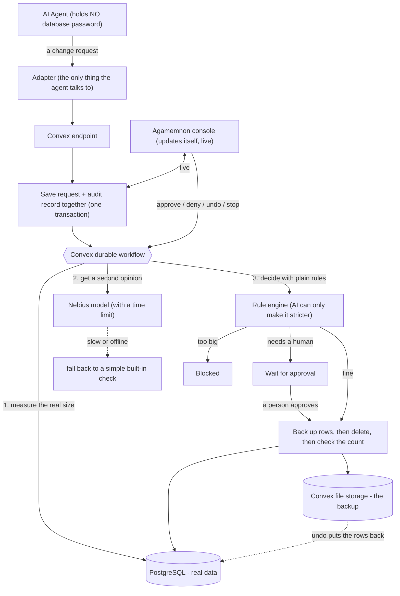

<h1 align="center">AGAMEMNON</h1>
<p align="center"><b>A safety layer between an AI agent and your production database.</b></p>
<p align="center">So an autonomous agent can't quietly delete your company — even when it's fully authorised.</p>

<p align="center">
  
</p>

<p align="center">
  
  &nbsp;&nbsp;&nbsp;&nbsp;&nbsp;&nbsp;
  
</p>

<p align="center"><b>Built on Convex and Nebius.</b><br>
<sub>Convex runs the entire backend. Nebius Token Factory runs every AI model.</sub></p>

---

## Features

Agamemnon takes the database password away from the agent. The agent can no longer touch
the database directly; every attempted change becomes a **request** that Agamemnon reviews
before anything happens.

- **Audit first** — the request and its audit record are saved in one transaction, so every
  change has a paper trail.
- **Measures the real blast radius** — counts, with its own database access, exactly how many
  rows would be affected. Not the number the agent claims — the real number.
- **Plain, readable rules** — a pure TypeScript policy engine decides allow / needs-approval /
  block, and names each rule that fired.
- **AI second opinion that can only tighten** — a tuned Nebius model reviews each request,
  but it can only make a decision *stricter*, never looser. If it's slow or offline, a
  built-in heuristic takes over.
- **Human approval** — risky-but-plausible changes wait for a person to approve or deny.
- **Snapshot before delete, one-click undo** — the exact rows are backed up before any delete
  and can be restored in seconds; the undo is recorded as its own action.
- **One-time keys** — each delete runs with a key minted for that single action, then thrown
  away.
- **Live operator console** — every request, decision and reason updates in real time, with
  approve / deny / undo / stop controls.

---

## Architecture


```mermaid
flowchart TD
    AG["AI Agent (holds NO database password)"]
    AG -->|"a change request"| ADP["Adapter (the only thing the agent talks to)"]
    ADP --> HTTP["Convex endpoint"]
    HTTP --> KO["Save request + audit record together (one transaction)"]
    KO --> WF{{"Convex durable workflow"}}
    WF -->|"1. measure the real size"| PG[("PostgreSQL - real data")]
    WF -->|"2. get a second opinion"| NEB["Nebius model (with a time limit)"]
    NEB -.->|"slow or offline"| HEU["fall back to a simple built-in check"]
    WF -->|"3. decide with plain rules"| POL["Rule engine (AI can only make it stricter)"]
    POL -->|"too big"| BLK["Blocked"]
    POL -->|"needs a human"| PARK["Wait for approval"]
    POL -->|"fine"| EXEC
    PARK -->|"a person approves"| EXEC["Back up rows, then delete, then check the count"]
    EXEC --> PG
    EXEC --> FS[("Convex file storage - the backup")]
    CON["Agamemnon console (updates itself, live)"]
    CON <-->|"live"| KO
    CON -->|"approve / deny / undo / stop"| WF
    FS -.->|"undo puts the rows back"| PG
```

### Tech stack

| Layer | What we use | What it does here |
|---|---|---|
| **Policy engine** | TypeScript, zero dependencies | Decides allow / needs-approval / block. Pure functions, fully unit-tested, no AI in the decision path. |
| **Backend + durable workflow** | Convex (local deployment) | Runs the request lifecycle — measure → classify → park → snapshot → delete → verify — so a crash mid-delete can't lose the audit record. Also live queries for the console, blob storage for undo snapshots, and the env var holding the DB password the agent never sees. |
| **Database** | PostgreSQL 14 | The production database being protected. |
| **Risk classifier** | `Qwen3-30B`, tuned — served on Nebius Token Factory | Second opinion on each request. Strict JSON out, 800 ms cap, heuristic fallback. |
| **Supporting models** | `Llama-3.3-70B`, `DeepSeek-V4`, `gemma-3-27b` | Agent reasoning; eval baselines. |
| **Console** | React + Vite | The operator console (`:5174`). |
| **Desktop apps** | Electron | Packages the guard server, datastore and an embedded terminal into macOS apps that run with no backend setup. |
| **Runtime** | Node 24 | Pinned; the local Convex backend rejects newer versions. |

### Repository layout

```
packages/agamemnon/         THE PRODUCT
  convex/    the backend: rules, review workflow, backups, undo
  adapter/   the shim the agent imports (never holds a password)
  console/   the operator console  ->  http://localhost:5174
  eval/      the labelled test set and the classifier scoreboard

packages/meridian/          SAMPLE APPLICATION protected by Agamemnon
  web/       web app + live dashboard  ->  http://localhost:5173
  db/        database schema and seed
  agent/     the AI agent

packages/agamemnon-guard/   DESKTOP: the guard app (owns data, runs the :7420 server)
packages/northwind-bank/    DESKTOP: a bank back-office that talks only to the guard
packages/halcyon/           DESKTOP: all-in-one app with installable guard + embedded terminal

docs/        RUN-AGAMEMNON.md — desktop apps and the guard API
```

---

## How to run

### Full stack (Convex + Nebius + Postgres)

Requirements: Node 24, PostgreSQL 14 on `127.0.0.1:5432`, and a Nebius Token Factory key.
Step-by-step first-time setup is in [SETUP.md](SETUP.md).

```bash
cp .env.example .env     # then paste your Nebius key into NEBIUS_API_KEY=
make setup               # generate DB creds, create the database + roles, seed it
make convex-dev          # start the local Convex backend (leave running)
make provision           # push env + policy into Convex
make up                  # start the console and the sample web app
```

Then open the console at `http://localhost:5174`.

Other useful targets:

```bash
make test     # run the policy engine unit tests
make eval     # score the classifiers (results appear in the console's Eval tab)
make verify   # show the most recent actions recorded in Convex
make reset    # restore a clean database state
make down     # stop all services
make help     # list every target
```

### Desktop apps (macOS, no backend setup)

```bash
open "/Applications/Halcyon.app"              # all-in-one app

# or the two interlinked apps:
open "/Applications/Agamemnon.app"            # start the guard first (:7420)
open "/Applications/Northwind Financial.app"  # then the bank back-office
```

Query the guard directly to see the reasoning behind a decision:

```bash
curl -s -X POST http://127.0.0.1:7420/guard/propose -H 'content-type: application/json' \
  -d '{"selector":{"all":true},"actor":"rogue-agent"}' \
  | jq '{decision, records: .measuredRows, why_the_classifier: .classifier.rationale,
         why_the_rules: [.firedRules[] | (.name + " — " + .detail)]}'
```

Full commands and output are in [docs/RUN-AGAMEMNON.md](docs/RUN-AGAMEMNON.md).

---

## Licence

**Proprietary. Copyright (c) 2026 Elamaran Elangovan. All rights reserved.**

This repository is published for demonstration, evaluation and portfolio review
only. **Publication is not a licence.** You may read it and link to it. You may
not copy, modify, redistribute, deploy, or use it or any part of it in another
product, service, dataset or model-training corpus without prior written
permission.

Every source file carries a copyright notice and a reference identifier; these
must not be removed or altered. Full terms in [LICENSE](LICENSE); summary in
[NOTICE](NOTICE).

Licensing enquiries: elango@squareshift.co
